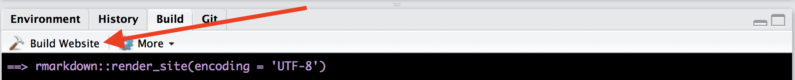
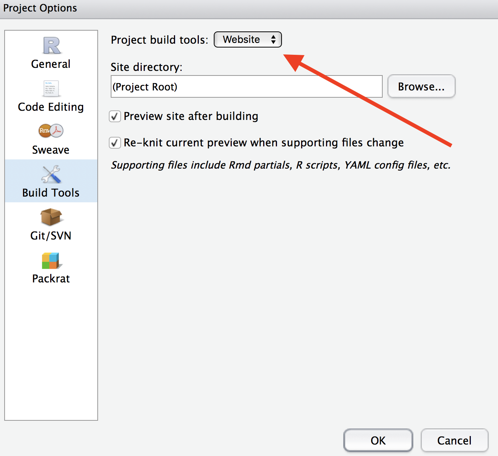

# RMarkdown Tools: Interactive Presentations, Apps, Websites
Cory Merow  
9/19/2017  

> This tutorial is a quick start guide extending the basic R Markdown skills from __ to getting started with interactive presentations, apps that can be hosted online or run locally, and R-based websites. The RStudio team has excellent complete tutorials on each of these (); this tutorial is meant to show how easy it is to get started with some key features.

# Interactive presentations (with ioSlides)

## Motivation

Interactive Slides ...

  * allow you or students to tinker with inputs and see the results on the fly
  * are completely reproducible and sharable
  * update presentation automatically if code changes
  * maintain simplicity in presentations

## Getting Started
To create an ioslides presentation from R Markdown you specify the ioslides_presentation output format in the front-matter of your document. Open a new file with
**File -> New File -> RMarkdown -> Presentation -> HTML(ioslides) **
and paste in the following chunks:


```r
---
title: "Demo with ioslides"
author: Cory Merow
date: Sept, 20, 2017
output: ioslides_presentation
runtime: shiny
---

## Example Heading

  Headings are specified by #, ##, or ----

## Text formatting

**bold**

`code`

equations: $H=-\sum_{i=1}^S p_i \log_b  p_i$

## Lists

* list element 1
    + subelement (this line needs to start with a tab, not a space)
* list element 2
    + subelement
```


## Interactive web elements

Elements like these can be places directly in your presentation.


```
## Loading required package: permute
```

```
## Loading required package: lattice
```

```
## This is vegan 2.4-1
```


**Download the extended version of this demo to see interactive components**  [<i class="fa fa-file-code-o fa-3x" aria-hidden="true"></i> here](07_03assets/Demo_ioslides.Rmd).

More on [basic markdown authoring](http://rmarkdown.rstudio.com/authoring_basics.html)

Comprehensive [ioslides tutorial](http://rmarkdown.rstudio.com/ioslides_presentation_format.html)

## Display Modes

The following single character keyboard shortcuts enable alternate display modes:

  * 'f' enable fullscreen mode
  * 'w' toggle widescreen mode
  * 'o' enable overview mode
  * 'h' enable code highlight mode
  * 'p' show presenter notes

<br>

***

<br>

# Applications (with Shiny)

If you find the interactive components useful, it only a small jump to full app development with `shiny`

This isn't R markdown, but rather another way to use interactive widgets.

## Motivation

* Dynamically interacting with research helps others understand your work
* Allows point-and-click that's actually reproducible with code

## A simple demo

The simplest starting point is [here](https://shiny.rstudio.com/gallery/kmeans-example.html)

[Shiny app gallery](https://shiny.rstudio.com/gallery/)

## A fancy example: Wallace


```r
# install.packages('wallace')  # only if you haven't already
library(wallace)
run_wallace()
```

In case you're curious, here's the [source code for wallace](https://github.com/wallaceEcoMod/wallace)

<br>

***

<br>

# Websites (like this)

All the content for this website was generated from R Markdown documents. You can download of fork the repo [here](https://github.com/cmerow/RDataScience) to make your own.

**We encourage others to use and modify our content on their own websites.** It'd be nice if you mentioned us (Adam Wilson and Cory Merow).

<br>

## Demo

1. Download a website template based on this site [here](https://www.dropbox.com/s/2oeu1pwlz0it1xb/Demo_R_Website.zip?dl=0)

<!-- [<i class="fa fa-file-code-o fa-3x" aria-hidden="true"></i> here](07_03_assets/Demo_R_Website.zip). -->

2. Unzip the directory and open a new RStudio project, setting this as the directory

3. Under the build tab, you should see 'build website'. Click it and you have a website.


4. If you don't see this button, set the project build tools to website (click project name on the top right, then project options)


<br>

## Tips

There a few tricks to get this up and running once you've created an RStudio project and added the cloned version our repo:

  * All the .Rmd files for the website need to be in the same directory (that's why the github repo looks a little messy).
  * You simply write the Rmd, click Run Document (analogous to knit), and the other files are built automatically
  * There are a couple of website-specific files to edit:

    + _site.html: sitewide formatting options
    + _navbar.html: set up the tabs along the tops of pages
    + index.Rmd: set up the welcome page


<!-- ## Colophon -->

