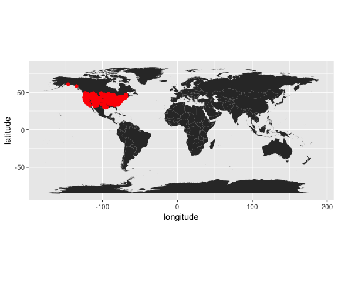

# Reproducible and Interactive Research
Cory Merow & Adam Wilson  
9/19/2017  


# Getting started

You may need to install some software for this sequence of 5 tutorials.

- **RStudio** (convienient way to interact with R) : https://www.rstudio.com/products/rstudio/download/#download 
- **git** (version control): <br> https://git-scm.com/downloads
- Create a **GitHub** account (sharing code online) at [https://github.com/](https://github.com/)
- **R packages** (for these demos): `install.packages(c('knitr','shiny','dplyr','ggplot2','maps','spocc',''wallace'), dep=T)`
- **pandoc** (to convert among document formats like html, pdf, docx): http://pandoc.org/installing.html

<!-- --------------------------------------------------------------------------------------- -->
<!-- --------------------------------------------------------------------------------------- -->
<br><br><br><br>

# Overview

- 3.1 Research Reports with R markdown
- 3.2 Version control with Github
- 3.3 Interactive presentations
- 3.4 Developing Web Applications with Shiny
- 3.5 Developing R websites (like this)

The same set of R Markdown tools is used for all these!

## Benefits are straightforward

- **Verification & Reliability**: Find and fix bugs. 
- **Transparency**: Increased citation count, broader impact, institutional memory
- **Efficiency**: Reduces duplication of effort, Colleagues like you and ask for advice
- **Flexibility**: When you don’t 'point-and-click' you gain many new analytic options.

## But limitations are substantial

- Classified/sensitive/big data
- Nondisclosure agreements & intellectual property 
- Competition
- Few expect reproducibility 
- No uniform standards
- Inertia & embarassment

## A spectrum of reproducibility


<small>Peng 2011, Science 334(6060) pp. 1226-1227</small>

## Code > Click trails {.columns-2}

- Clicks = Lots of human effort for tedious & time-wasting tasks
- Clicks = Error-prone due to manual & ad hoc data handling
- Clicks = Difficult to record -  hard to reconstruct a 'click history'
- Code = Improved transparency, automation, maintanability, accessibility, standardisation, modularity, portability, efficiency, communicability of process (what more could we want?)
- Code = Plain text files readable for a _long_ time
  
<!-- ## Literate programming: for and against   {.columns-2} -->

<!-- **Pros** -->

<!-- - Text & code in one place, in logical order -->
<!-- - Tables and figures automatically updated -->
<!-- - Automatic test when building document -->

<!-- **Cons** -->

<!-- - Text and code in one place; can be hard to read -->
<!-- - Can slow down the processing of documents (use caching!) -->

<br><br><br><br>

# Reproducible Research in R

- Programming language:  
    - The machine-readable part: R
- Document formatting language 
    - Markdown: lightweight document formatting syntax. Easy to write, read and publish as-is.
- Human-readable part
    - `rmarkdown`:  minor extensions to allow R code display and execution, embed images in html files, equations

`knitr`: Dynamic documents in R  {.columns-2}

- Narrative and code in the same file or explicitly linked
- When data or narrative are updated, the document is automatically updated

<!-- --------------------------------------------------------------------------------------- -->
<!-- --------------------------------------------------------------------------------------- -->
<br>

***

<br>

#  Demo

## R Markdown Cheatsheet

<a href="https://www.rstudio.com/wp-content/uploads/2015/02/rmarkdown-cheatsheet.pdf"> </a>

<small><small><small>[https://www.rstudio.com/wp-content/uploads/2015/02/rmarkdown-cheatsheet.pdf](https://www.rstudio.com/wp-content/uploads/2015/02/rmarkdown-cheatsheet.pdf)</small></small></small>

The [reference guide](https://www.rstudio.com/wp-content/uploads/2015/03/rmarkdown-reference.pdf) is a little more comprehensive

## Create new file
In Rstudio:
**File -> New File -> RMarkdown -> Document -> HTML**


This will open a document that looks like this:


<!--  -->


## Step 1: Load packages

All R code to be run must be in a _code chunk_ like this:

```r
#```{r,eval=F}
CODE HERE
#```
```

Add a new _code chunk_ at the bottom of this template file to load these packages (you may need to install some packages):


```r
library(dplyr)
library(ggplot2)
library(maps)
library(spocc)
```

> Do you think you should put `install.packages()` calls in your script?


## Step 2: Load data

Now use the `occ()` function in **new** _code chunk_ to download all the _occurrence_ records for the American robin (_Turdus migratorius_) from the [Global Biodiversity Information Facility](gbif.org).


<small><small><small>Licensed under CC BY-SA 3.0 via [Wikimedia Commons](https://commons.wikimedia.org/wiki/File:Turdus-migratorius-002.jpg#/media/File:Turdus-migratorius-002.jpg)</small></small></small>


```r
## define which species to query
sp='Turdus migratorius'

## run the query and convert to data.frame()
d = occ(query=sp, from='ebird',limit = 100) %>% occ2df()
```

## Step 3: Map it


```r
# Load coastline
map=map_data("world")

ggplot(d,aes(x=longitude,y=latitude))+
  geom_polygon(aes(x=long,y=lat,group=group,order=order),data=map)+
  geom_point(col="red")+
  coord_equal()
```

```
## Warning: Ignoring unknown aesthetics: order
```

<!-- -->

## Step 4:

Update the YAML header to keep the markdown file from this:

```r
title: "Untitled"
author: "Adam M. Wilson"
date: "October 31, 2016"
output: html_document
```

To this (you need to save the markdown (md) document to make the html):

```r
title: "Demo"
author: "Adam M. Wilson"
date: "October 31, 2016"
output: 
  html_document:
      keep_md: true
```

And click `knit HTML` to generate the output


kniting  produces a number of files all extracted from the Rmd you wrote, seen below


* .Rmd - you wrote this
* .md - plain markdown, with the R code already run
* .R - just the R code chunks, useful for rerunning just the code
* .html - the output file for others to view
* /YourDocumentName_files - any files generated from running the R code

In case you had trouble generating this document, [<i class="fa fa-file-code-o fa-3x" aria-hidden="true"></i> the R Script associated with this page is available here](07_assets/demo/Demo.Rmd). 

## Step 5:  Explore markdown functions

1. Use the Cheatsheet to add sections and some example narrative.  
2. Add more figures or different versions of a figure
3. Check out the `kable()` function for tables (e.g. `kable(head(d))`)
4. Some example of slightly more complex Rmd files:
  - [<i class="fa fa-file-code-o fa-3x" aria-hidden="true"></i> the vignette from the R package _bossMaps_](07_assets/bossMaps_demo_rmd.Rmd). 
  <!-- Additions to note:  -->
  <!--     * the _knitr::opts_chunk$set_ allows you to change some settings throughout the document -->
  <!--     * code chunk argument _message=F_ to suppress function messages -->
  <!--     * code chunk argument _fig.width_ to customize the size of a -->
* The [R markdown gallery](http://rmarkdown.rstudio.com/gallery.html) with examples of interactive documents, websites, books, and presentations, that we'll demonstrate in the next tutorials

## Step 6: Tips

* Caching will speed up compiling

```r
#```{r,eval=F}
knitr::opts_chunk$set(cache=TRUE)
#```
```
* Hide the code, just show the results

```r
#```{r, echo=FALSE}
```
* Don't evaluate the code (maybe its slow or broken)

```r
#```{r, eval=FALSE}
```
<!-- --------------------------------------------------------------------------------------- -->
<!-- --------------------------------------------------------------------------------------- -->
<br><br><br><br>

# More Background

## Key References

* [Rmarkdown homepage](http://rmarkdown.rstudio.com/)
* [html document format](http://rmarkdown.rstudio.com/html_document_format.html)
* [using code chunks](http://rmarkdown.rstudio.com/authoring_rcodechunks.html)

## Pandoc: document converter  {.columns-2}

How does markdown magically convert between document types (html, pdf, docx)? 

A universal document converter, open source, cross-platform

* Write code and narrative in rmarkdown   
* knitr->markdown (with computation)   
* use pandoc to get HTML/PDF/DOCX
* its also very easy and useful from the command line: https://pandoc.org/demos.html


<small><small><small>http://kieranhealy.org/blog/archives/2014/01/23/plain-text/ </small></small></small>

## Colophon

* [Slides based on Ben Marwick's presentation to the UW Center for Statistics and Social Sciences (12 March 2014)](https://github.com/benmarwick/CSSS-Primer-Reproducible-Research) ([OrcID](http://orcid.org/0000-0001-7879-4531))

## References

See Rmd file for full references and sources


