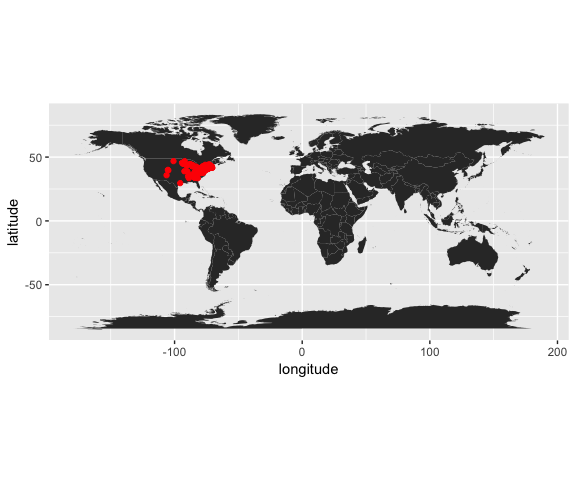

# Untitled
Cory Merow  
9/19/2017  


## R Markdown

This is an R Markdown document. Markdown is a simple formatting syntax for authoring HTML, PDF, and MS Word documents. For more details on using R Markdown see <http://rmarkdown.rstudio.com>.

When you click the **Knit** button a document will be generated that includes both content as well as the output of any embedded R code chunks within the document. You can embed an R code chunk like this:


```r
summary(cars)
```

```
##      speed           dist       
##  Min.   : 4.0   Min.   :  2.00  
##  1st Qu.:12.0   1st Qu.: 26.00  
##  Median :15.0   Median : 36.00  
##  Mean   :15.4   Mean   : 42.98  
##  3rd Qu.:19.0   3rd Qu.: 56.00  
##  Max.   :25.0   Max.   :120.00
```

## Including Plots

You can also embed plots, for example:

<!-- -->

Note that the `echo = FALSE` parameter was added to the code chunk to prevent printing of the R code that generated the plot.


```r
library(dplyr)
library(ggplot2)
library(maps)
library(spocc)
```


```r
## define which species to query
sp='Turdus migratorius'

## run the query and convert to data.frame()
d = occ(query=sp, from='ebird',limit = 100) %>% occ2df()
```

## Step 3: Map it


```r
# Load coastline
map=map_data("world")

ggplot(d,aes(x=longitude,y=latitude))+
  geom_polygon(aes(x=long,y=lat,group=group,order=order),data=map)+
  geom_point(col="red")+
  coord_equal()
```

```
## Warning: Ignoring unknown aesthetics: order
```

<!-- -->

