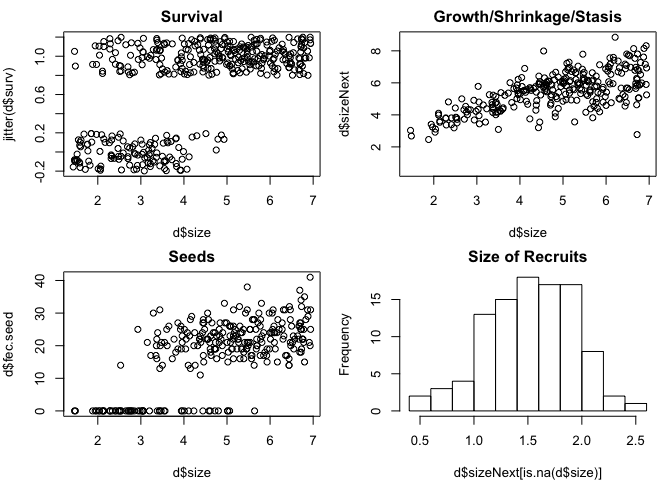
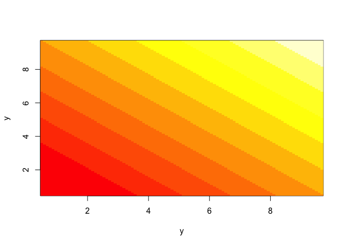
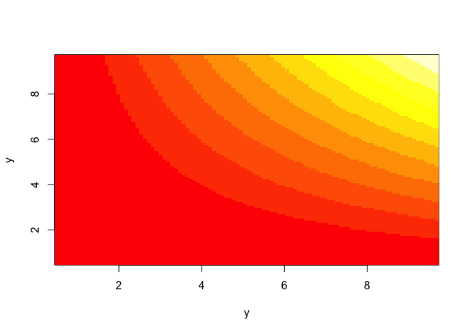
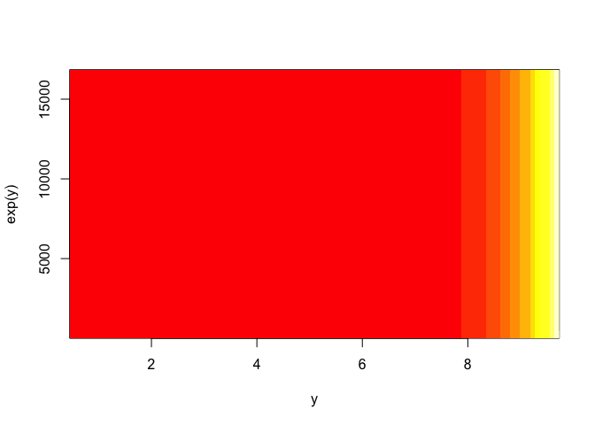
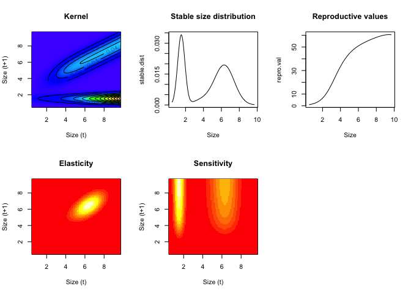

# Introduction to Integral Projection Models
Cory Merow  
10/5/2017  

> This tutorial gives a practical overview of building stage-structured (e.g. size, age) population models use integral projection models.


<div>
<object data="21_assets/Intro_to_IPMs_short.pdf" type="application/pdf" width="100%" height="650px"> 
  <p>It appears you don't have a PDF plugin for this browser.
   No biggie... you can <a href="21_assets/Intro_to_IPMs_short.pdf">click here to
  download the PDF file.</a></p>  
 </object>
 </div>
 
 <p><a href="21_assets/Intro_to_IPMs_short.pdf">Download the PDF of the presentation</a></p>  

[<i class="fa fa-file-code-o fa-3x" aria-hidden="true"></i> The R Script associated with this page is available here](21_Intro_IPMs.R).  Download this file and open it (or copy-paste into a new script) with RStudio so you can follow along.  

# Introductory IPM exercises

Here, we introduce a simple IPM for a the long-lived alpine perennial plant Dracocephalum austriacum. The analyses minimize the complexity of the R code in order to make the model transparent. We calculate basic population statistics, including population growth rate, sensitivity, elasticity, and passage times throughout to check the plausibility of the model. 
 
The document is organized as follows

  1. plots for data exploration
  2. parameter estimation for regressions
  3. build vital rate functions
  4. make a kernel
  5. basic analyses


<!-- ```{r} -->
<!-- 	# set up directory structure. we'll place a temp folder on your desktop to store some plots -->
<!-- # if(!file.exists('~/Desktop/Temp_IPM_output')) dir.create('~/Desktop/Temp_IPM_output') -->
<!-- 	# set this as the working directory -->
<!-- # setwd('~/Desktop/Temp_IPM_output')  -->
<!-- ``` -->

<br>

***

<br>

# Data exploration
 
To read in the data you'll have to set your own file path here. 
	
<p><a href="21_assets/Exercises/Intro_to_IPMs_Exercises_Data.csv">Download the data csv</a></p>  
	


```r
d=read.csv('21_assets/Exercises/Intro_to_IPMs_Exercises_Data.csv')
```


You'll notice that adults are stored at the beginning of the data set with values for size (measured in 2001) and sizeNext (measured in 2002). the number of seeds and flowering status were measured in 2001.


```r
head(d)
```

<div data-pagedtable="false">
  <script data-pagedtable-source type="application/json">
{"columns":[{"label":["size"],"name":[1],"type":["dbl"],"align":["right"]},{"label":["sizeNext"],"name":[2],"type":["dbl"],"align":["right"]},{"label":["surv"],"name":[3],"type":["int"],"align":["right"]},{"label":["fec.seed"],"name":[4],"type":["int"],"align":["right"]},{"label":["fec.flower"],"name":[5],"type":["int"],"align":["right"]}],"data":[{"1":"3.09","2":"NA","3":"0","4":"NA","5":"NA"},{"1":"2.81","2":"NA","3":"0","4":"NA","5":"NA"},{"1":"4.46","2":"6.07","3":"1","4":"15","5":"1"},{"1":"1.68","2":"NA","3":"0","4":"NA","5":"NA"},{"1":"3.99","2":"NA","3":"0","4":"NA","5":"NA"},{"1":"4.07","2":"NA","3":"0","4":"NA","5":"NA"}],"options":{"columns":{"min":{},"max":[10]},"rows":{"min":[10],"max":[10]},"pages":{}}}
  </script>
</div>

New recruits are stored at the end and were only observed in the second survey (2002)


```r
tail(d)
```

<div data-pagedtable="false">
  <script data-pagedtable-source type="application/json">
{"columns":[{"label":["size"],"name":[1],"type":["dbl"],"align":["right"]},{"label":["sizeNext"],"name":[2],"type":["dbl"],"align":["right"]},{"label":["surv"],"name":[3],"type":["int"],"align":["right"]},{"label":["fec.seed"],"name":[4],"type":["int"],"align":["right"]},{"label":["fec.flower"],"name":[5],"type":["int"],"align":["right"]}],"data":[{"1":"NA","2":"1.78","3":"NA","4":"NA","5":"NA"},{"1":"NA","2":"1.01","3":"NA","4":"NA","5":"NA"},{"1":"NA","2":"1.68","3":"NA","4":"NA","5":"NA"},{"1":"NA","2":"1.44","3":"NA","4":"NA","5":"NA"},{"1":"NA","2":"1.08","3":"NA","4":"NA","5":"NA"},{"1":"NA","2":"1.62","3":"NA","4":"NA","5":"NA"}],"options":{"columns":{"min":{},"max":[10]},"rows":{"min":[10],"max":[10]},"pages":{}}}
  </script>
</div>


```r
	# make some plots -  figure 1
par(mfrow=c(2,2),mar=c(4,4,2,1))
plot(d$size,jitter(d$surv),main='Survival') # jittered to see easier
plot(d$size,d$sizeNext,main='Growth/Shrinkage/Stasis')	
plot(d$size,d$fec.seed,main='Seeds') # jittered to see easier
hist(d$sizeNext[is.na(d$size)],main='Size of Recruits')
```

<!-- -->

Note that we use NAs for missing or non-applicable data rather than 0 or some other indicator because this causes them to be automatically excluded from r's regression functions.

The model we'll build takes the general form
$ n[z',t+1]=\int{ ( P[z',z]+ F[z',z] ) n[z,t] dz} $

where z' is size at time t+1 and z is size at time t. P is the growth/survival kernel and F is the fecundity kernel. these will be decomposed further as:

$ P[z',z]=growth[z',z] * survival[z] $ 

$ F[z',z]=floweringProbability[z] * seedsPerIndividual[z] * establishmentProbability * recruitSize[z'] $

We'll begin building the regressions for each of these vital rates in the next section.

<br>

***

<br>

# Regressions for vital rate functions


```r
# 0. set up parameter list for regressions
	# this sets up a list of the model parameters. these parameters will be estimated and recorded below.
params=data.frame(
	surv.int=NA,
	surv.slope=NA,
	growth.int=NA,
	growth.slope=NA,
	growth.sd=NA,
	seed.int=NA,
	seed.slope=NA,
	recruit.size.mean=NA,
	recruit.size.sd=NA,
	establishment.prob=NA
)

# 1. survival regression
surv.reg=glm(surv~size,data=d,family=binomial())
summary(surv.reg)
```

```
## 
## Call:
## glm(formula = surv ~ size, family = binomial(), data = d)
## 
## Deviance Residuals: 
##     Min       1Q   Median       3Q      Max  
## -2.2275  -0.5815   0.2491   0.5597   2.0972  
## 
## Coefficients:
##             Estimate Std. Error z value Pr(>|z|)    
## (Intercept)  -3.9646     0.4760  -8.329   <2e-16 ***
## size          1.2897     0.1338   9.642   <2e-16 ***
## ---
## Signif. codes:  0 '***' 0.001 '**' 0.01 '*' 0.05 '.' 0.1 ' ' 1
## 
## (Dispersion parameter for binomial family taken to be 1)
## 
##     Null deviance: 488.69  on 399  degrees of freedom
## Residual deviance: 315.82  on 398  degrees of freedom
##   (100 observations deleted due to missingness)
## AIC: 319.82
## 
## Number of Fisher Scoring iterations: 5
```

```r
params$surv.int=coefficients(surv.reg)[1]
params$surv.slope=coefficients(surv.reg)[2]

# 2. growth regression
growth.reg=lm(sizeNext~size,data=d)
summary(growth.reg)
```

```
## 
## Call:
## lm(formula = sizeNext ~ size, data = d)
## 
## Residuals:
##     Min      1Q  Median      3Q     Max 
## -3.8037 -0.5434  0.0932  0.5741  2.6732 
## 
## Coefficients:
##             Estimate Std. Error t value Pr(>|t|)    
## (Intercept)  2.68135    0.19580   13.69   <2e-16 ***
## size         0.57922    0.03902   14.84   <2e-16 ***
## ---
## Signif. codes:  0 '***' 0.001 '**' 0.01 '*' 0.05 '.' 0.1 ' ' 1
## 
## Residual standard error: 0.8866 on 278 degrees of freedom
##   (220 observations deleted due to missingness)
## Multiple R-squared:  0.4421,	Adjusted R-squared:  0.4401 
## F-statistic: 220.3 on 1 and 278 DF,  p-value: < 2.2e-16
```

```r
params$growth.int=coefficients(growth.reg)[1]
params$growth.slope=coefficients(growth.reg)[2]
params$growth.sd=sd(resid(growth.reg))
```


```r
# 3. seeds regression
# note that we are just pooling all individuals into this regression regardless of whether they flowered or not. a later exercise will be to explicitly model flowering probability. i.e. for the moment we're taking floweringProbability[z]=1.
seed.reg=glm(fec.seed~size,data=d,family=poisson())
summary(seed.reg)
```

```
## 
## Call:
## glm(formula = fec.seed ~ size, family = poisson(), data = d)
## 
## Deviance Residuals: 
##     Min       1Q   Median       3Q      Max  
## -6.5338  -1.8830   0.0529   1.5375   4.9690  
## 
## Coefficients:
##             Estimate Std. Error z value Pr(>|z|)    
## (Intercept)  1.33234    0.06370   20.92   <2e-16 ***
## size         0.30647    0.01164   26.34   <2e-16 ***
## ---
## Signif. codes:  0 '***' 0.001 '**' 0.01 '*' 0.05 '.' 0.1 ' ' 1
## 
## (Dispersion parameter for poisson family taken to be 1)
## 
##     Null deviance: 2598.3  on 279  degrees of freedom
## Residual deviance: 1840.1  on 278  degrees of freedom
##   (220 observations deleted due to missingness)
## AIC: 2942.2
## 
## Number of Fisher Scoring iterations: 5
```

```r
params$seed.int=coefficients(seed.reg)[1]
params$seed.slope=coefficients(seed.reg)[2]

# 4. size distribution of recruits
	# in the dataframe, recruits are those individuals who have a value for sizeNext but not for size
params$recruit.size.mean=mean(d$sizeNext[is.na(d$size)])
params$recruit.size.sd=sd(d$sizeNext[is.na(d$size)])

# 5. establishment probability
	# these data represent a single year's worth of data, hence establishment probability can be estimated by dividing the number of observed recruits by the number of seeds. hence the growth/survival measurements were taken in year t which the recruit sizes were measured in year t+1.
params$establishment.prob=sum(is.na(d$size))/sum(d$fec.seed,na.rm=TRUE)

# 6. plot the models over the data - figure 2
par(mfrow=c(2,2),mar=c(4,4,2,1))
xx=seq(0,8,by=.01)
plot(d$size,d$sizeNext,main='Growth/Shrinkage/Stasis')	
	lines(xx,predict(growth.reg,data.frame(size=xx)),col='red',lwd=3)
plot(d$size,jitter(d$surv),main='Survival') # jittered to see easier
	lines(xx,predict(surv.reg,data.frame(size=xx),type='response'), col='red',lwd=3)
plot(d$size,d$fec.seed,main='Seeds') # jittered to see easier
	lines(xx,predict(seed.reg,data.frame(size=xx),type='response'), col='red',lwd=3)
hist(d$sizeNext[is.na(d$size)],main='Size of Recruits',freq=FALSE)
	lines(xx,dnorm(xx,params$recruit.size.mean,params$recruit.size.sd), col='red',lwd=3)
```

<!-- -->

<br>

***

<br>

# Build vital rate functions

Each of the functions below represents one or more of the vital rates. these functions are used to build the IPM and use output (the coefficients) from the regressions developed above. 

These functions represent the modeler's decision about how to decompose the life cycle. in this very simple example, we model (1) survival, (2) growth, (3) seed number, (4) the seedling size distribution and (5) the establishment probability. these last three functions are combined in the model for fecundity below. in practice, we'd need to decide what regressions to build in part B in advance, but it's easier to digest this section after you've seen the regressions above, so fortunately we built all the right regressions already. in practice, sections B and C are iterative one might inform one another. 


```r
## vital rate functions

# 1. probability of surviving
s.x=function(x,params) {
	u=exp(params$surv.int+params$surv.slope*x)
	return(u/(1+u))
}

# 2. growth function
g.yx=function(xp,x,params) { 			
	dnorm(xp,mean=params$growth.int+params$growth.slope*x,sd=params$growth.sd)
}

# 3. reproduction function      
f.yx=function(xp,x,params) { 		
	params$establishment.prob*
	dnorm(xp,mean=params$recruit.size.mean,sd=params$recruit.size.sd)*
	exp(params$seed.int+params$seed.slope*x)
}
```

<br>

***

<br>

# Make a kernel

In this section, we combine the vital rate functions to build the discretized IPM kernel, which we’ll call the IPM matrix (e.g. shown in Fig. 2c in the main text).These steps are performed behind the scenes in the IPMpack package used in Appendices C-G for convenience, but we show them here for illustrative purposes. To integrate, we begin by defining the boundary points (b; the edges of the cells defining the matrix), mesh points (y; the centers of the cells defining the matrix and the points at which the matrix is evaluated for the midpoint rule of numerical integration), and step size (h; the widths of the cells). The integration limits (min.size and max.size) span the range of sizes observed in the data set, and then some.


```r
# 1. boundary points b, mesh points y and step size h
	# integration limits - these limits span the range of sizes observed in the data set, and then some.
min.size=.9*min(c(d$size,d$sizeNext),na.rm=T)
max.size=1.1*max(c(d$size,d$sizeNext),na.rm=T)
	# number of cells in the discretized kernel
n=100 
	# boundary points (the edges of the cells defining the kernel)
b=min.size+c(0:n)*(max.size-min.size)/n 
# mesh points (midpoints of the cells)
y=0.5*(b[1:n]+b[2:(n+1)])
# width of the cells
h=y[2]-y[1]
```

Next, we make the IPM matrices. The function outer() evaluates the matrix at all pairwise combinations of the two vectors y and y and returns matrices representing the kernel components for growth and fecundity, respectively. For the numerical integration, we’re using the midpoint rule (the simplest option) estimate the area under a curve. The midpoint rule assumes a rectangular approximation. The heights of the rectangles are given by the outer function and the width of the rectangles is h. 


```r
# 2. make component kernels
par(mfrow=c(2,3)) 

G=h*outer(y,y,g.yx,params=params) 	# growth kernel
image(y,y,t(G),main='growth kernel') 		# plot it

S=s.x(y,params=params) 							# survival 
plot(y,S,type='l',main='survival')	# plot it

P=G 																# placeholder;redefine P on the next line
for(i in 1:n) P[,i]=G[,i]*S[i]  		# growth/survival kernel
image(y,y,t(P),main='survival/growth kernel')	# plot it
abline(0,1,lwd=3)										# plot 1:1, which represents stasis

F=h*outer(y,y,f.yx,params=params) 	# reproduction kernel
image(y,y,t(F),main='fecundity kernel')	# plot it

K=P+F 															# full kernel
image(y,y,t(K),main='full kernel')			# plot it

# sometimes it's hard to see both the fecundity part of the kernel swamps the growth/survival part, so here's a plotting trick to level out the kernel
image(y,y,t(K)^.3,main='full kernel^0.3')			# plot it
```

<!-- -->

So what did the outer function just do to make the kernel? the way we've used it, it takes all pairwise combinations of the the first argument (y) with the second (also y), and does some operation to those combinations. here are a few examples:


```r
tmp1=outer(y,y,'+')
image(y,y,t(tmp1))
```

<!-- -->

```r
tmp2=outer(y,y,'*')
image(y,y,t(tmp2))
```

<!-- -->

```r
tmp3=outer(y,exp(y),'+')
image(y,exp(y),t(tmp3))
```

<!-- -->
In the IPM case, the operation that we want is not a simple '+' or '*', but the slightly more complicated growth function, given in the third argument (g.yx). to use the growth function, we need to specify the regression coefficients, so the fourth argument supplies the list 'params' that we defined above, which aer passed to g.yx. 

<br>

***

<br>

# Population Summaries

Analyses usually begin with obtaining the eigenvalues (λ) and eigenvectors (v-left; w-right) of the matrix. These are useful for understanding the asymptotic dynamics. The dominant eigenvalue gives the asymptotic population growth rate (lam). The right eigenvector gives the stable stage distribution and the left eigenvector gives the reproductive value, when normalized.


```r
# 1. get lamda,v,w  
(lam=Re(eigen(K)$values[1])) # should be 1.013391
```

```
## [1] 1.013391
```

```r
w.eigen=Re(eigen(K)$vectors[,1])
stable.dist=w.eigen/sum(w.eigen) 
v.eigen=Re(eigen(t(K))$vectors[,1])
repro.val=v.eigen/v.eigen[1] 


# The eigen-things can be combined to obtain the sensitivity and elasticity matrices.
# 2. compute elasticity and sensitivity matrices
v.dot.w=sum(stable.dist*repro.val)*h
sens=outer(repro.val,stable.dist)/v.dot.w
elas=matrix(as.vector(sens)*as.vector(K)/lam,nrow=n)

# 3. plot results 

par(mfrow=c(2,3)) 
image(y,y,t(K), xlab="Size (t)",ylab="Size (t+1)",col=topo.colors(100), main="Kernel")
contour(y,y,t(K), add = TRUE, drawlabels = TRUE)
plot(y,stable.dist,xlab="Size",type="l",main="Stable size distribution")
plot(y,repro.val,xlab="Size",type="l",main="Reproductive values") 
image(y,y,t(elas),xlab="Size (t)",ylab="Size (t+1)",main="Elasticity")
image(y,y,t(sens),xlab="Size (t)",ylab="Size (t+1)", main="Sensitivity")
```

<!-- -->


<!-- ## Colophon -->
