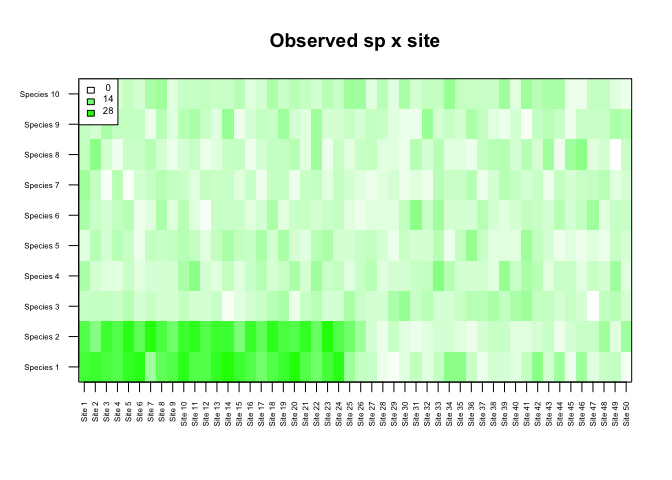
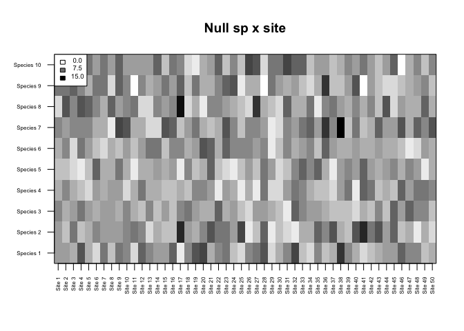
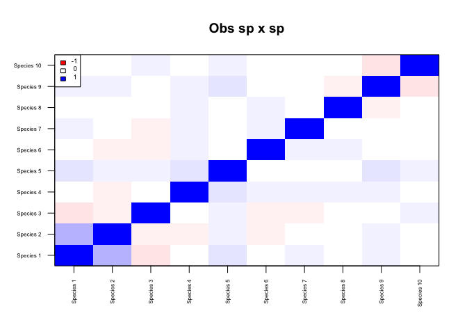
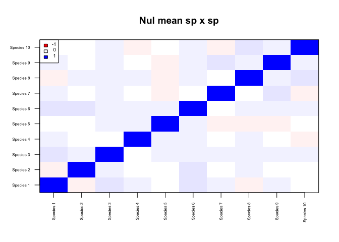
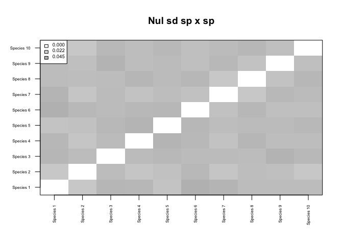
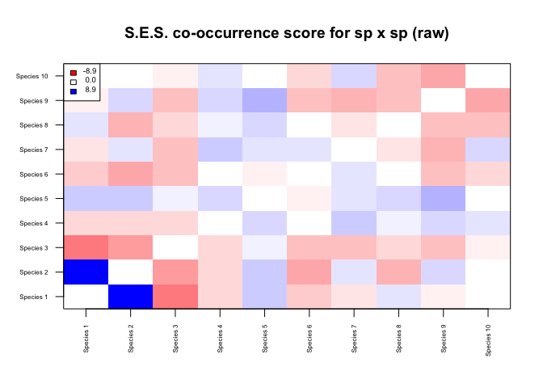
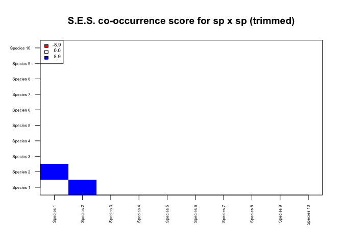
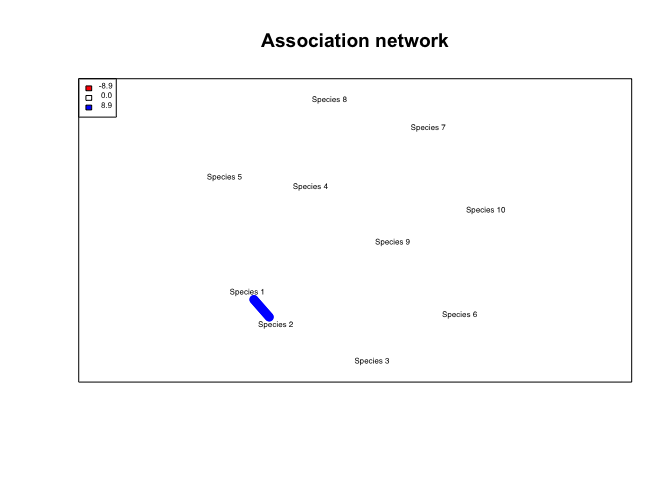

# Community Network Analysis
Naia Morueta-Holme  


<div>
<object data="3_2_assets/network_slides.pdf" type="application/pdf" width="100%" height="650px"> 
  <p>It appears you don't have a PDF plugin for this browser.
   No biggie... you can <a href="3_2_assets/network_slides.pdf">click here to
  download the PDF file.</a></p>  
 </object>
 </div>
 
 <p><a href="3_2_assets/network_slides.pdf">Download the PDF of the presentation</a></p>  
 

[<i class="fa fa-file-code-o fa-3x" aria-hidden="true"></i> The R Script associated with this page is available here](3_2_Networks.R).  Download this file and open it (or copy-paste into a new script) with RStudio so you can follow along.  

# Setup

```r
library(netassoc)
```

## Generate some random 'observed' data

```r
set.seed(1)

# Number of m species
nsp <- 10
# Number of n sites
nsi <- 50

# Observed m x n community matrix (abundance or presence/absence)
m_obs <- floor(matrix(rpois(nsp*nsi,lambda=5),ncol=nsi,nrow=nsp))

# "Force" some species associations to the observed community matrix
m_obs[1,1:(nsi/2)] <- rpois(n=nsi/2,lambda=20)
m_obs[2,1:(nsi/2)] <- rpois(n=nsi/2,lambda=20)
```

## What is the null expectation?

```r
# Null expected m x n community matrix (abundance or presence/absence)
m_nul <- floor(matrix(rpois(nsp*nsi,lambda=5),ncol=nsi,nrow=nsp))
```
Note that here we are simply resampling the observed data preserving row and column sums, which is NOT recommended. Instead, we should use our expected null model of community assembly.


## Infer the species association network

```r
# What species co-occurrence patterns are more or less likely than expected under the null model?
n <- make_netassoc_network(m_obs, m_nul,
  method="partial_correlation",
  args=list(method="shrinkage"), # for alternative estimators see ?partial_correlation
  p.method='fdr', 
  numnulls=100, 
  plot=TRUE,
  alpha=0.05)
```

<!-- --><!-- -->

```
## Calculating observed co-occurrence scores...
```

<!-- -->

```
## Generating null replicate 1...
## Generating null replicate 2...
## Generating null replicate 3...
## Generating null replicate 4...
## Generating null replicate 5...
## Generating null replicate 6...
## Generating null replicate 7...
## Generating null replicate 8...
## Generating null replicate 9...
## Generating null replicate 10...
## Generating null replicate 11...
## Generating null replicate 12...
## Generating null replicate 13...
## Generating null replicate 14...
## Generating null replicate 15...
## Generating null replicate 16...
## Generating null replicate 17...
## Generating null replicate 18...
## Generating null replicate 19...
## Generating null replicate 20...
## Generating null replicate 21...
## Generating null replicate 22...
## Generating null replicate 23...
## Generating null replicate 24...
## Generating null replicate 25...
## Generating null replicate 26...
## Generating null replicate 27...
## Generating null replicate 28...
## Generating null replicate 29...
## Generating null replicate 30...
## Generating null replicate 31...
## Generating null replicate 32...
## Generating null replicate 33...
## Generating null replicate 34...
## Generating null replicate 35...
## Generating null replicate 36...
## Generating null replicate 37...
## Generating null replicate 38...
## Generating null replicate 39...
## Generating null replicate 40...
## Generating null replicate 41...
## Generating null replicate 42...
## Generating null replicate 43...
## Generating null replicate 44...
## Generating null replicate 45...
## Generating null replicate 46...
## Generating null replicate 47...
## Generating null replicate 48...
## Generating null replicate 49...
## Generating null replicate 50...
## Generating null replicate 51...
## Generating null replicate 52...
## Generating null replicate 53...
## Generating null replicate 54...
## Generating null replicate 55...
## Generating null replicate 56...
## Generating null replicate 57...
## Generating null replicate 58...
## Generating null replicate 59...
## Generating null replicate 60...
## Generating null replicate 61...
## Generating null replicate 62...
## Generating null replicate 63...
## Generating null replicate 64...
## Generating null replicate 65...
## Generating null replicate 66...
## Generating null replicate 67...
## Generating null replicate 68...
## Generating null replicate 69...
## Generating null replicate 70...
## Generating null replicate 71...
## Generating null replicate 72...
## Generating null replicate 73...
## Generating null replicate 74...
## Generating null replicate 75...
## Generating null replicate 76...
## Generating null replicate 77...
## Generating null replicate 78...
## Generating null replicate 79...
## Generating null replicate 80...
## Generating null replicate 81...
## Generating null replicate 82...
## Generating null replicate 83...
## Generating null replicate 84...
## Generating null replicate 85...
## Generating null replicate 86...
## Generating null replicate 87...
## Generating null replicate 88...
## Generating null replicate 89...
## Generating null replicate 90...
## Generating null replicate 91...
## Generating null replicate 92...
## Generating null replicate 93...
## Generating null replicate 94...
## Generating null replicate 95...
## Generating null replicate 96...
## Generating null replicate 97...
## Generating null replicate 98...
## Generating null replicate 99...
## Generating null replicate 100...
## Calculating standardized effect sizes...
```

<!-- --><!-- -->

```
## Adjusting p-values for multiple comparisons...
```

<!-- --><!-- --><!-- -->

```
## Building network...
```

<!-- -->

```r
n$network_all
```

```
## IGRAPH DNW- 10 2 -- 
## + attr: name (v/c), weight (e/n)
## + edges (vertex names):
## [1] Species 1->Species 2 Species 2->Species 1
```
