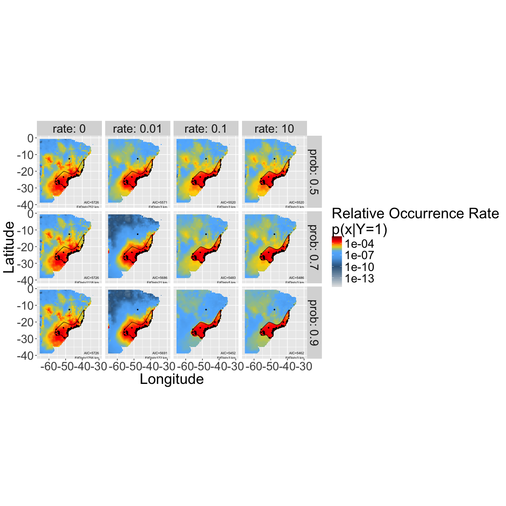

# Incorporating Expert Range Maps in SDMs


[<i class="fa fa-file-code-o fa-3x" aria-hidden="true"></i> The R Script associated with this page is available here](3_5_Minxent.R).  Download this file and open it (or copy-paste into a new script) with RStudio so you can follow along.  

# Setup

## Load necessary libraries

```r
library(ggplot2)
library(foreach)
registerDoSEQ()
library(dplyr)
library(tidyr)
library(bossMaps)
library(raster)
```

### Load example data for the Solitary Tinamou

```r
species=c("Tinamus_solitarius")

data("Tinamus_solitarius_points")
data("Tinamus_solitarius_range")
data("Tinamus_solitarius_env")

points=Tinamus_solitarius_points
range=Tinamus_solitarius_range
env=Tinamus_solitarius_env
```

<!-- <div class="well"> -->
<!-- Create a new variable called `y` and set it to `15` -->

<!-- <button data-toggle="collapse" class="btn btn-primary btn-sm round" data-target="#demo1">Show Solution</button> -->
<!-- <div id="demo1" class="collapse"> -->
<!-- ```{r, purl=F} -->
<!-- y=15 -->
<!-- ``` -->
<!-- </div> -->
<!-- </div> -->

# Calculate Priors

## Calculate range distances
<div class="well">
Calculate the distance between expert range edge and all cells on the map (useful for estimating how likelihood of the species should decay as you get further from the expert map).

<button data-toggle="collapse" class="btn btn-primary btn-sm round" data-target="#demo1">Kind of a digression....</button>
<div id="demo1" class="collapse">


```r
rdist = rangeDist(
  range = range,
  points = points,
  domain = env,
  domainkm = 1000,
  mask = F,
  fact = 2
  )
```

```
## Rasterizing range to ROI
## Calculating distances
## Resampling back to original resolution
```

```r
## Crop environmental data to this new domain (based on domainkm)
env_domain = crop(env, rdist)

## Mask pixels with no environmenta data (over ocean, etc.)
rdist = mask(rdist, env_domain[[1]])
names(rdist) = "rangeDist"
```
</div>
</div>

This is the result:

```r
plot(rdist)
```

```
## NOTE: rgdal::checkCRSArgs: no proj_defs.dat in PROJ.4 shared files
## NOTE: rgdal::checkCRSArgs: no proj_defs.dat in PROJ.4 shared files
## NOTE: rgdal::checkCRSArgs: no proj_defs.dat in PROJ.4 shared files
```

```r
plot(range, add = T)
plot(points, add = T)
```

<!-- -->

## Evaluate curves describing expert accuracy beyond the expert map boundaries

<div class="well">
Calculate which curve parameter combinations are feasible given the domain and range geometry.

<button data-toggle="collapse" class="btn btn-primary btn-sm round" data-target="#demo2">Kind of a digression....</button>
<div id="demo2" class="collapse">


```r
rates=checkRates(rdist)
```

```
## Calculating the range distance frequency table, you can also provide this with the dists parameter.
## Fitting the expert range decay, this can take a while depending on how many values you selected...
```

<!-- -->

From these, choose a few 

```r
vars=expand.grid(
  prob=c(0.5, 0.7, 0.9),
  rate=c(0,0.01,0.1,10),
  skew=0.5,
  shift=0,
  stringsAsFactors=F)
x=seq(-150,500,len=1000)
```

Calculate all the curves

```r
uvars=unique(vars[,c("rate","skew","shift")])
erd=do.call(rbind,
            lapply(1:nrow(uvars),function(i) {
              y=logistic(x,
                         parms=unlist(c(lower=0,upper=1,uvars[i,])))  
              return(cbind.data.frame(
                group=i,
                c(uvars[i,]),
                x=x,
                y=y))
            })
)  
```

Visualize potential decay parameters

```r
ggplot(erd,
       aes(
       x = x,
       y = y,
       linetype = as.factor(skew),
       colour = as.factor(rate),
       group = group
       )) +
       geom_vline(aes(xintercept = 0), colour = "red") +
       geom_line() +
       xlab("Prior value (not normalized)") +
       xlab("Distance to range edge (km)")
```

<!-- -->
</div>
</div>

## Build priors
<div class="well">

Calculate the priors and project them across the landscape as rasters.

<button data-toggle="collapse" class="btn btn-primary btn-sm round" data-target="#demo3">Kind of a digression....</button>
<div id="demo3" class="collapse">     

Calculate frequency table of distances: In order to speed up optimization of range offsets, we calculate the `rangeOffset()` on a frequency distribution instead of the full raster.  Calculate that now with `freq()`.


```r
dists = freq(rdist, useNA = "no", digits = 2)
knitr::kable(head(dists))
```


   value   count
--------  ------
 -289.97       1
 -289.50       1
 -288.72       1
 -288.45       1
 -280.91       1
 -280.47       1


```r
mcoptions <- list(preschedule = FALSE, set.seed = FALSE)
foreach(i = 1:nrow(vars), .options.multicore = mcoptions) %do% {
  ## calculate the expert range prior
  fo = paste0(species, "_prior_", paste(vars[i, ], collapse = "_"), ".grd")
  if (file.exists(fo))  return(NULL)
  expert = rangeOffset(
                      rdist,
                      parms = unlist(vars[i, ]),
                      dists = dists,
                      doNormalize = T,
                      verbose = T,
                      doWriteRaster = T,
                      filename = fo,
                      overwrite = T,
                      datatype = "FLT4S"
                      )
}
```
</div>
</div>

## Stack the priors

Here's where we'll pick up the analysis, assuming you've somehow created a reasonable prior already (unfold code above for an example with expert maps). Priors for your analyses might come from sampling bias models, maps of related species, or expert maps, among many other possibilities (Merow et al. 2016 GEB).

```r
fs = list.files(pattern = "prior.*grd$",
                full = T,
                recursive = F)
                
priors = stack(fs)
                
## build prior table from metadata
priorf = foreach(i = 1:nlayers(priors), 
                 .combine = bind_rows) %do% {
  t1 = metadata(priors[[i]])
  t2 = t1$parms
  names(t2) = t1$pnames
  return(data.frame(id = i, t(t2)))
  }

names(priors) = paste0("prior", priorf$id)#basename(fs[wp])
plot(priors)
```

<!-- -->

# MaxEnt/Poisson Point Process SDM

## Assemble modeling dataset

```r
## build single raster stack of all needed data (env and priors)
rdata = stack(env, priors)

## generate presence and non-detection datasets
pres = cbind.data.frame(
  presence = 1, 
  raster::extract(rdata, points, df =
  T, ID = F))
ns = 10000
abs = cbind.data.frame(
  presence = 0,
  ID = 1:ns,
  sampleRandom(rdata, ns))
```

```
## NOTE: rgdal::checkCRSArgs: no proj_defs.dat in PROJ.4 shared files
```

```r
data = rbind.data.frame(
  pres, 
  abs)
```

## Fit models
You can fit a maxent-style model or Poisson point process with `glm()` simply by applying weights to the data. See the appendix of Renner et al. 2015 (Point process models for presence-only analysis; GEB) for details on why this works. Note that I'm not fitting all the flexible functional forms of a maxent model; this is equivalent to turning off threshold and hinge features and note using regularization.


```r
data$weight = 1e-6
best.var = names(env)

# number of non-NA cells
nc = cellStats(!is.na(priors[[1]]), sum)
```

```
## NOTE: rgdal::checkCRSArgs: no proj_defs.dat in PROJ.4 shared files
## NOTE: rgdal::checkCRSArgs: no proj_defs.dat in PROJ.4 shared files
```

```r
data$weight[data$presence == 0] = nc / sum(data$presence == 0)

## Set up models
formulas = paste(
  "presence/weight ~",
  " offset(log(",
  grep("prior", 
       colnames(data),
       value = T),'))+',
  paste0(sapply(
    best.var, function(ii) {
      sapply(best.var, function(jj) {
        paste0(ii, "*", jj)
    })
  }), collapse = '+'),
  '+',
  paste0('I(', best.var, '^2)', collapse = '+'),
  '+',
  paste0(best.var, collapse = ':')
)

formulas[1]
```

```
## [1] "presence/weight ~  offset(log( prior1 ))+ bio1*bio1+bio1*bio12+bio12*bio1+bio12*bio12 + I(bio1^2)+I(bio12^2) + bio1:bio12"
```

```r
mods = foreach(f = formulas) %do% {
  glm(
    as.formula(f),
    family = poisson(link = log),
    data = data,
    weights = weight
  )
}
```

Calculate AIC

```r
priorf$AIC=unlist(lapply(mods,function(x) AIC(x)))
```

## Make spatial predictions

```r
mcoptions <- list(preschedule = FALSE, set.seed = FALSE)

ptype = "response"
psi = 1:nrow(priorf)

ps = foreach(i = psi, 
  .options.multicore = mcoptions) %dopar% {
    fo = paste0(
      species,"_posterior_",
      priorf$prob[i],"_",
      priorf$rate[i],"_",
      priorf$skew[i],"_",
      priorf$shift[i],
      ".grd"
      )
  if (file.exists(fo))
    return(NULL)
  #if(!file.exists(fo)) return("NOT YET")
  normalize(
    raster::predict(
      rdata,
      mods[[i]],
      type = ptype),
    file = fo,
    overwrite = T)
}
```

```
## Warning: executing %dopar% sequentially: no parallel backend registered
```

```r
psf = list.files(pattern = "posterior.*.grd", full = T)
ps = stack(psf)
names(ps) = sub("prior", "posterior", names(priors)[psi])
```

## Predictions maps for different priors/offesets

<!-- -->


<!-- ## Transects across all priors -->

<!-- ### Extract data along transects -->

<!-- ```{r} -->
<!-- ## Extract transect -->
<!-- transect = SpatialLinesDataFrame(SpatialLines(list(Lines(list( -->
<!--   Line(cbind(c(-51.85,-62.45), c(-26.01,-14.82))) -->
<!-- ), ID = "a"))), -->
<!-- data.frame(Z = c("transect"), row.names = c("a"))) -->


<!-- trans = do.call( -->
<!--   rbind.data.frame, -->
<!--   raster::extract( -->
<!--     stack(rdist, rdata, ps), -->
<!--   transect, -->
<!--   along = T, -->
<!--   cellnumbers = T -->
<!--   )) -->

<!-- trans[, c("lon", "lat")] = coordinates(rdata)[trans$cell] -->
<!-- ## get order to identify non-monotonic increase -->
<!-- trans$order = 1:nrow(trans) -->
<!-- ## drop pixels in which range dist is decreasing as order increases -->
<!-- ## This is to remove situation if transect starts from not-center of rangemap -->
<!-- ## e.g. plot(order~rangeDist,data=trans) -->
<!-- trans = trans[trans$order > trans$order[which.min(trans$rangeDist)], ] -->

<!-- transl = group_by(trans, lon, lat) %>% -->
<!--   gather(variable, value,-lon,-lat,-cell,-rangeDist,-order) -->

<!-- ## separate prior/posterior data -->
<!-- transp = filter(transl, !variable %in% c("bio1", "bio12")) -->

<!-- ## add prior id column -->
<!-- transp$type = ifelse(grepl("prior", transp$variable), "Offset", "Prediction") -->
<!-- transp$id = as.numeric(sub("prior|posterior", "", transp$variable)) -->
<!-- ## order levels for convenient plotting -->
<!-- transp$type = factor(transp$type, -->
<!--                      levels = c("Prediction", "Offset"), -->
<!--                      ordered = T) -->
<!-- ## add prior information -->
<!-- transp$rate = priorf$rate[match(transp$id, priorf$id)] -->
<!-- transp$prob = priorf$prob[match(transp$id, priorf$id)] -->
<!-- transp = transp[order(transp$rangeDist), ] -->
<!-- transp$label = factor(paste0("Rate=", transp$rate, " Prob=", transp$prob), ordered = -->
<!--                         T) -->
<!-- ``` -->

<!-- ```{r} -->
<!-- ggplot(transp, aes( -->
<!--   x = rangeDist, -->
<!--   y = value, -->
<!--   colour = type, -->
<!--   group = type -->
<!-- )) + -->
<!--   scale_y_log10() + -->
<!--   facet_grid(prob ~ rate, labeller = label_both) + -->
<!--   geom_vline(xintercept = 0, -->
<!--              linetype = "dashed", -->
<!--              colour = "black") + -->
<!--   geom_path() + -->
<!--   xlab("Distance from range edge") + -->
<!--   ylab("Relative Occurrence Rate P(X|Y=1)") + -->
<!--   scale_color_manual(values = c("red", "black")) + -->
<!--   ggtitle(paste(species, " prior and posterior values along transect")) -->
<!-- ``` -->
