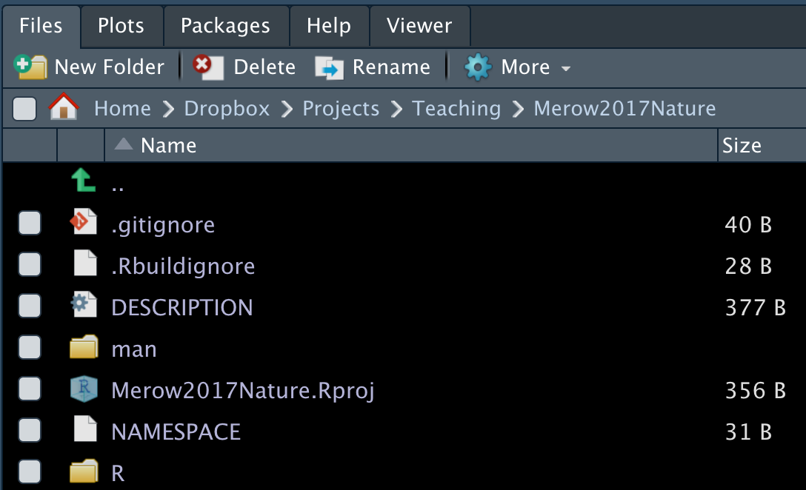
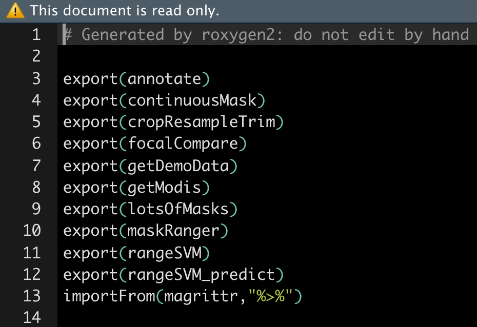

```{r setup, include=FALSE}
knitr::opts_chunk$set(cache=TRUE)
```

<!-- ----------------------------------------------------------------------------- -->
<!-- ----------------------------------------------------------------------------- -->
# Getting started

You may need to install some software for this sequence of 3 tutorials.

- **RStudio** (convienient way to interact with R) :<br> https://www.rstudio.com/products/rstudio/download/#download 
- **git** (version control): <br> https://git-scm.com/downloads
- Create a **GitHub** account (sharing code online) at <br> [https://github.com/](https://github.com/)
- **R packages** (for these demos):<br> `install.packages(c('knitr','shiny','dplyr','ggplot2','maps','spocc',''wallace','rmarkdown'), dep=T)`
- **pandoc** (to convert among document formats like html, pdf, docx): <br>http://pandoc.org/installing.html
<!-- ----------------------------------------------------------------------------- -->
<!-- ----------------------------------------------------------------------------- -->


<br>

# Overview

- Quickly generate a working example, and work backwards to understand the components
- Sharing code
- Reproducible research
- Future you will appreciate you more
- Advancing your programming skills for *other* applications

> For anyone using this document outside of a lecture, please note that this lesson is designed to distill the key features of a package for publishing reproducible research. This approach cuts a lot of corners on nerdy details that can take beginners a lot of time to wade through, keeping them away from the science that motivates their efforts. This approach is *not* designed for generic packages that will be broadly used. There are many other, better resources for [that](http://r-pkgs.had.co.nz/).

<br>

## Topics we'll cover

- Package structure - what are all the different files for?
- Writing Functions 
- Documentation (with Roxygen2)
- The ******* DESCRIPTION file
- Checking and Building packages
- Distributing packages (github)
- General Tips
- Things to read more about


<!-- ----------------------------------------------------------------------------- -->
<!-- ----------------------------------------------------------------------------- -->
<br>

# Package structure

Let's start by making your first package. Start a new project in RStudio (File...New Project). A box pops, where you can choose 'New Directory', followed by 'R Package' to get to this screen:


<br>
Think of a name for your package. I'm choosing `Merow2017Nature` because that might be the name of a paper I'm sharing code for. Note that you should **check the box**  'Create a git repository'. We'll come back to that later. Selecting 'Create project' will build a template with all the essential files for a package. Done. You made a package.

Packages have four required components: 

- a file called DESCRIPTION. It contains metadata about the package
- a directory called R. It cas the code
- a directory called man. It has the documentation (and not men, counterintuitively)
- a file called NAMESPACE. I lists functions in the package (automatically generated, so not interesting)

<br>



Then there are some optional files too. The .Rproj one stores info for developing with RStudio, while .gitignore and .Rbuildignore will come up later, along with some others we haven't made yet for sharing data, vignettes, etc.


<!-- ----------------------------------------------------------------------------- -->
<!-- ----------------------------------------------------------------------------- -->
<br>

# Writing Functions

Tips
BREAK THIS INTO A SEPARATE LESSON
- default values for arguments
- passing arguments
- simplifying arguments with lists
- hidden functions don't need documentation
- functions can be organized in files however you like in the **R** folder of your package


```{r}
# thanks to software carpentry for the nice demo functions!
fahrenheit_to_celsius <- function(temp_F) {
  # Converts Fahrenheit to Celsius
  temp_C <- (temp_F - 32) * 5 / 9
  return(temp_C)
}
celsius_to_kelvin <- function(temp_C) {
  # Converts Celsius to Kelvin
  temp_K <- temp_C + 273.15
  return(temp_K)
}
fahrenheit_to_kelvin <- function(temp_F) {
  # Converts Fahrenheit to Kelvin using fahrenheit_to_celsius() and celsius_to_kelvin()
  temp_C <- fahrenheit_to_celsius(temp_F)
  temp_K <- celsius_to_kelvin(temp_C)
  return(temp_K)
}
```

<!-- ----------------------------------------------------------------------------- -->
<!-- ----------------------------------------------------------------------------- -->
<br>

# Documentation (with Roxygen2)

Roxygen2 is where its at; I haven't noticed anyone use anything else in years. 

roxygen2 reads lines that begin with #' as comments to create the documentation for your package. Descriptive tags are preceded with the @ symbol. For example, @param has information about the input parameters for the function.

```{r}
#' Converts Fahrenheit to Celsius
#'
#' This function converts input temperatures in Fahrenheit to Celsius.
#' @param temp_F The temperature in Fahrenheit.
#' @return The temperature in Celsius.
#' @export
#' @examples
#' fahrenheit_to_kelvin(32)

fahrenheit_to_celsius <- function(temp_F) {
  temp_C <- (temp_F - 32) * 5 / 9
  return(temp_C)
}
```

To build the documentation after writing the chunk above, use:
```{r,eval=FALSE}
devtools::document()
```

A list of all available tags is here. You're likely to need 6-7 more of them, like `@note`, `@references`, `@author`. You might use `@details`, `@family`, `@seealso` if you're fancy.
```{r}
names(roxygen2:::default_tags())
```

The NAMESPACE file is one for the 4 essential files in a package, and is automatically generated when you use `document()`. It lists all the functions that are exported, which means that other user have easy access to them when they install and load your package, as well as functions you imported from other packages using `@importFrom` in your roxygen2 documentation. Here's an example:



roxygen2 configuration in RStudio:


<!-- ----------------------------------------------------------------------------- -->
<!-- ----------------------------------------------------------------------------- -->
<br>

# The ******* DESCRIPTION file
The DESCRIPTION file contains all the metadata needed for your pacakge. Seems pretty straighforward. Lots of obvious info to provide. But you can spend a lot of time debugging cryptic errors if you don't get the syntax perfect. 

Here's an example of one from our `maskRangeR` package.


Here are some very interesting details that are important to save you time:

- The **Title** field must capitalize the first letter of each word. 
- Just use `as.person()` for the **Author** field. Previously there were more flexible ways to specify this, but its a standard now.
- **Description** must be a paragraph. And don't think a paragraph is two sentences long, buddy, or CRAN will tell you otherwise. They now subcontract with the paragraph police.
- My **LICENSE** field has a standard MIT license and refers to an optional second file, called LICENSE, which lives in you root directory and includes any other specifications you want.
- In **Imports** and **Suggests**, make sure packages are on their own lines, tab indented, and have no spaces between lines. 
- You probably shouldn't have as many dependencies as I do here. It can make it tough to maintain your package if other's change. But it works often. A better solution is just to import the specific function you need from another package, if you only need 1 or 2 functions from that package.

<!-- ----------------------------------------------------------------------------- -->
<!-- ----------------------------------------------------------------------------- -->
<br>

# Checking, Building  and Installing packages

These three steps are lumped together here because you're often jumping back and forth between them as you're honing in on a working package. 

Note that you can use the point and click interface on RStudio's Build menu or `check()`, `build()`, and `install()` for these steps if you averse to clicks.


## Check
To ensure you've followed the right protocols for building your package, R offers a series of checking tools. There are options, but it's safest just to check with CRAN's standards as they're rigorous. 

## Build

## Install


<!-- ----------------------------------------------------------------------------- -->
<!-- ----------------------------------------------------------------------------- -->
<br>

# Distributing packages (github)
I'm just going to demonstrate the super simple clicky version of using github with RStudio. If you want more features or to try the command line, try this easy [tutorial](https://swcarpentry.github.io/git-novice/). There are many others too; no need to reproduce here. (There's a reproducibility joke here somewhere that I'm missing ....)

Follow [these instructions](https://help.github.com/en/articles/adding-an-existing-project-to-github-using-the-command-line) to create a new github repo and add the package you've been working with to . Follow these steps to 


`install_github()`
<!-- ----------------------------------------------------------------------------- -->
<!-- ----------------------------------------------------------------------------- -->
<br>

# General Tips

**Debugging** with `browser()`. `browser()` and `debug()` provide complementary ways to explore errors and see exactly what's going on inside your function, in the environment its working with.  Each allows you to step through the function line by line to explore problems. `browser()` is inserted inside the function on the line you want to begin exploring at. Try running this:
```{r}
fahrenheit_to_kelvin <- function(temp_F) {
  # Converts Fahrenheit to Kelvin using fahrenheit_to_celsius() and celsius_to_kelvin()
  temp_C <- fahrenheit_to_celsius(temp_F)
  browser()
  temp_K <- celsius_to_kelvin(temp_C)
  return(temp_K)
}
fahrenheit_to_kelvin(17)
```
There are three key commands to advance through the lines of code when in `browser()` or `debug()`:
 - `n` evaluate this line and move to next
 - `c` continue running lines till the function ends or breaks
 - `Q` get out of debug mode.
 Within debug mode, you can type any of the usual commands you'd use in R to see what objects in the environment look like, or to run other tests.

Alternatively to `browser()`, you can call `debug(yourFunctionName)` to step through every line, as though you had put your `browser()` command on line 1 of your function. `undebug()` gets you out of debug mode. 


**Adding a welcome message**. Here's an example from one my packages. Put this function in your R directory.
```{r, eval=F}
.onAttach <- function(libname,pkgname) {
  packageStartupMessage('Type, vignette("rmm_directory") for an overview of functions')
}
```

- 

<!-- ----------------------------------------------------------------------------- -->
<!-- ----------------------------------------------------------------------------- -->
<br>

# Demo!

Here's the plan. I want you to see what a fully functional R package looks like, but I don't want it to include a bunch of stats that obscure the challenge of understanding the package structure. So we'll fix an version of my `rangeModelMetadata` package that I've intentionally introduced errors to. This package just works with text to create a metadata object for species distribution models. 

1. Create a new package called `intentionallyBrokenRangeModelMetada`
2. Download these <!--  [files](https://cmerow.github.io/RDataScience/Quickstart_RPackages_assets/intentionallyBrokenRangeModelMetadata.zip).  -->
3. Put the files in your root directory (the one called intentionallyBrokenRangeModelMetada)
4. Run `devtools::document()` just to be sure all the manuals are built.  
5. Run `check()` either from the command line or through RStudio.
6. Start debugging with any problems you find, rerunning `check()` periodically to see if you've succeeded. Hint: I've only introduced 1 error per function.
7. You're done when there are no more NOTES, WARNINGS or ERRORS.


<!-- ----------------------------------------------------------------------------- -->
<!-- ----------------------------------------------------------------------------- -->
<br>

# Next steps

Almost always, the answer you need is well explained in Hadley Wickham's online book [here](http://r-pkgs.had.co.nz/). 

I just found this, so don't know it well, but ROpenSci does a ton of smart [stuff](https://devguide.ropensci.org/). 

Obviously there's the CRAN book on R extensions [here](https://cran.r-project.org/doc/manuals/r-release/R-exts.html).
It tends to be long and winding and hard to search. Don't bother with it unless you're having trouble sleeping.

- **R markdown**. A way to share project reports and vignettes with code, text, figures, etc.
  +  Party line: Super flexible, great for html 
  +  What I really think: It's really awesome. See this [lesson](https://cmerow.github.io/RDataScience/07_Reproducible.html) next. Sweave is prettier but less flexible.
- **Unit testing**. A way to automatically check your code every time its built. [Example](https://kbroman.org/pkg_primer/pages/tests.html)
  +  Party line: this is the best way to ensure your code does what it says.
  +  What I really think: it takes a fair amount of time to think of, and code, nontrivial tests. If you're just sharing code from a publication, its probably not necessary.
- **S3 and S4 methods**. So functions like `plot` and `print` work with objects from your code.
  + Party line: These represent the true power of the object-oriented coding that makes R appealing.
  + What I really think: Meh, you can just use a list and do most of the same stuff. 
- **Collaborating with git**.
  + Party line: git is super powerful for teams of people working on code concurrently to avoid breaking one another's work.
  + What I really think: git is awesome for tracking your edits and sharing on github. I don't do much fancy branching, merging or pull requesting, because I spend more time fixing mistakes I thought I understood. This is clearly because I'm just a gitiot and not git's fault...
- **Including data sets**. [Example](https://kbroman.org/pkg_primer/pages/data.html)
  + Party line: Its not complicated.
  + What I really think: I tend to include a lot, as users may find it easier access existing data. Note that on CRAN your package can't be over a few Mb but on github, files can be up to 50 Mb. Consider RData files and RDS files; they're usually fast and reasonably compressed, preserving the exact R object you saved. You can put them in /inst/ext/ if you're lazy and don't want to write documentation. Reference them with `system.file()`.