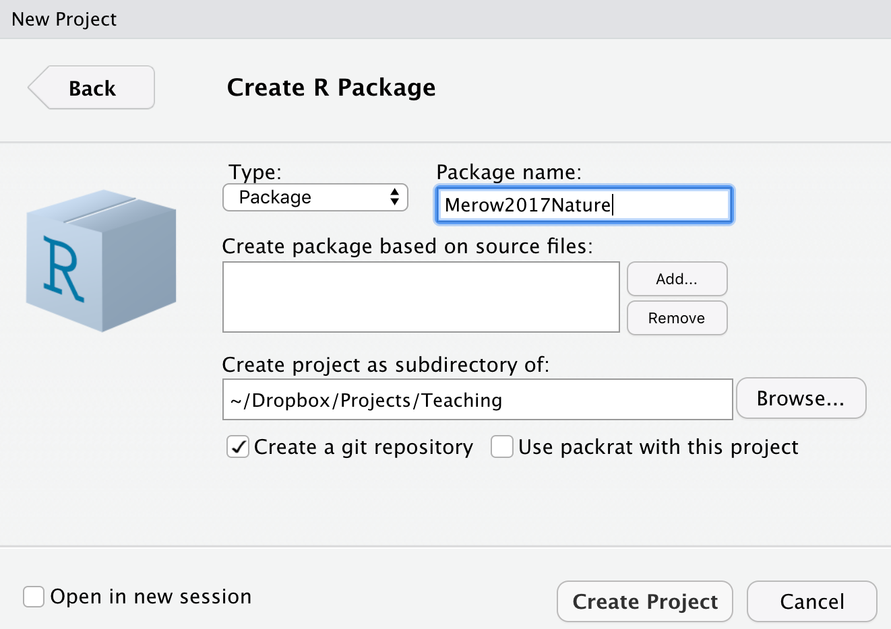
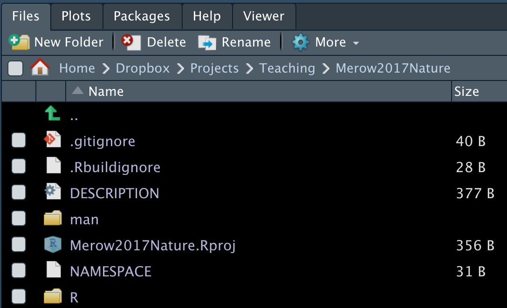
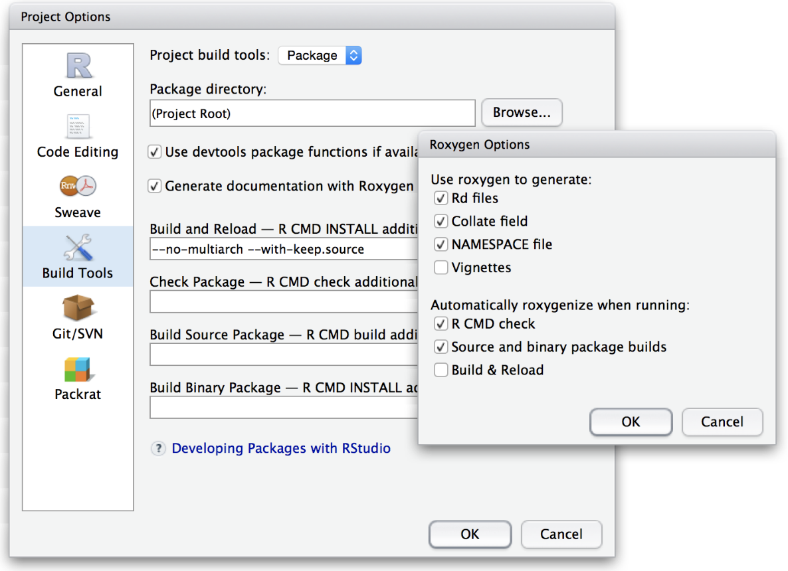
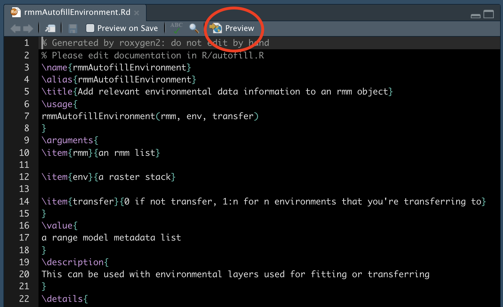
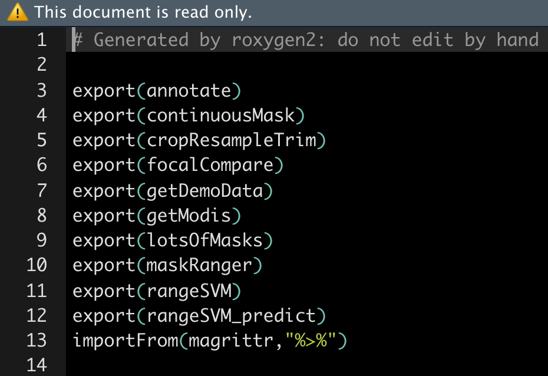
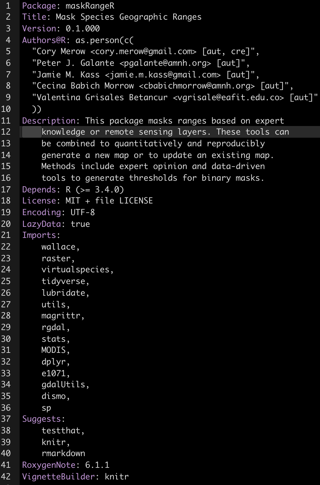
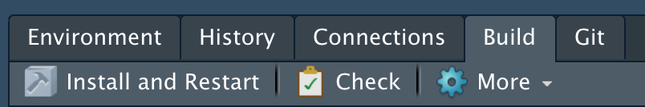
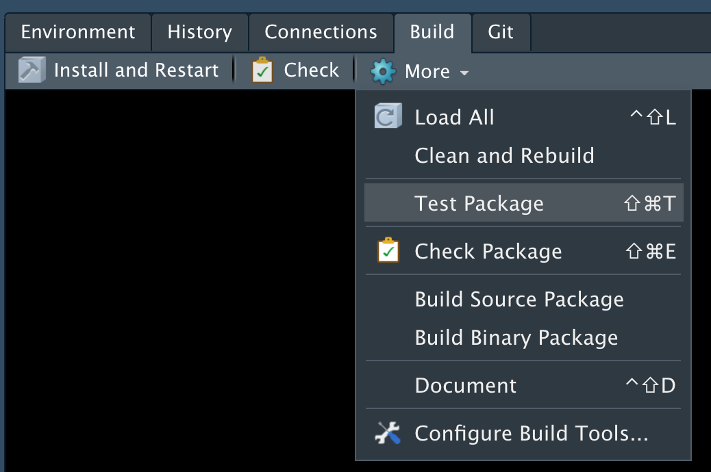
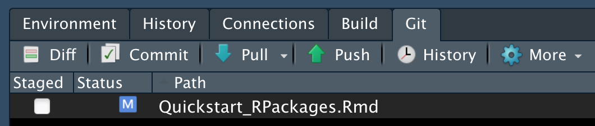

<!-- ----------------------------------------------------------------------------- -->
<!-- ----------------------------------------------------------------------------- -->
# Getting started

You may need to install some software for this sequence of 3 tutorials.

- **RStudio** (convenient way to interact with R) :<br> https://www.rstudio.com/products/rstudio/download/#download 
- **git** (version control): <br> https://git-scm.com/downloads
- Create a **GitHub** account (sharing code online) at <br> [https://github.com/](https://github.com/)
- **R packages** (for these demos):<br> `install.packages(c('knitr','shiny','dplyr','ggplot2','maps','spocc',''wallace','rmarkdown'), dep=T)`
- **pandoc** (to convert among document formats like html, pdf, docx): <br>http://pandoc.org/installing.html
<!-- ----------------------------------------------------------------------------- -->
<!-- ----------------------------------------------------------------------------- -->


<br>

# Why Build a package?

- Sharing code
- Reproducible research
- (Indirectly) Keeps your work organized so your code is less error-prone
- Future you will appreciate you more
- Advancing your programming skills for *other* applications

> For anyone using this document outside of a lecture, please note that this lesson is designed to distill the key features of a package for publishing reproducible research. This approach cuts a lot of corners on details that can take beginners a lot of time to wade through, keeping them away from the science that motivates their efforts. This approach is *not* designed for generic packages that will be broadly used. There are many other, better resources for [that](http://r-pkgs.had.co.nz/).

<br>

## Topics we'll cover
We'll quickly generate a working example, and work backwards to understand the components.

- Package structure - what are all the different files for?
- Writing Functions 
- Documentation (with Roxygen2)
- The ******* DESCRIPTION file
- Checking and Building packages
- Distributing packages (github)
- General Tips
- Things to read more about

<div class="well">
<button data-toggle="collapse" class="btn btn-primary btn-sm round" data-target="#demo2">Tangential Tip</button>
<div id="demo2" class="collapse">

These are sprinkled throughout. Only read them if everything is going really well...

</div>
</div>

<!-- ----------------------------------------------------------------------------- -->
<!-- ----------------------------------------------------------------------------- -->
<br>

# Package structure

Let's start by making your first package. Start a new project in RStudio (File...New Project). A box pops, where you can choose 'New Directory', followed by 'R Package' to get to this screen:



<br>
Think of a name for your package. I'm choosing `Merow2017Nature` because that might be the name of a paper I'm sharing code for. Note that you should **check the box**  'Create a git repository'. We'll come back to that later. Selecting 'Create project' will build a template with all the essential files for a package. Done. You made a package.

Packages have four required components: 

- a file called DESCRIPTION. It contains metadata about the package
- a directory called R. It has the code
- a directory called man. It has the documentation (and not men, counter intuitively)
- a file called NAMESPACE. I lists functions in the package (automatically generated, so not interesting)

<br>




Then there are some optional files too. The .Rproj one stores info for developing with RStudio as with any other projects you have, while .gitignore and .Rbuildignore will come up later, along with some others we haven't made yet for sharing data, vignettes, etc.


<!-- ----------------------------------------------------------------------------- -->
<!-- ----------------------------------------------------------------------------- -->
<br>

# Writing Functions

Now we need to add some functions. We'll get into a bunch of details on writing functions later, but here are some easy ones so we can focus on the package making process first. Put them in a file (or their own files) in the R/ folder of your package. You can organize them there and name files however you like. I like to use many files with veryShortandConciseNamesWrittenInCamelCase.


```r
# thanks to software carpentry for the nice demo functions!
fahrenheit_to_celsius <- function(temp_F) {
  # Converts Fahrenheit to Celsius
  temp_C <- (temp_F - 32) * 5 / 9
  return(temp_C)
}
celsius_to_kelvin <- function(temp_C) {
  # Converts Celsius to Kelvin
  temp_K <- temp_C + 273.15
  return(temp_K)
}
fahrenheit_to_kelvin <- function(temp_F) {
  # Converts Fahrenheit to Kelvin using fahrenheit_to_celsius() and celsius_to_kelvin()
  temp_C <- fahrenheit_to_celsius(temp_F)
  temp_K <- celsius_to_kelvin(temp_C)
  return(temp_K)
}
```

<!-- ----------------------------------------------------------------------------- -->
<!-- ----------------------------------------------------------------------------- -->
<br>

# Documentation (with `roxygen2`)

Documentation is a required element of an R pacakge. `roxygen2` is where its at; I haven't noticed anyone use anything else in years. It's convenient because your code and the documentation live together in the same file and the NAMESPACE file (describing your exported functions and other people's imported functions) is automatically generated.

`roxygen2` reads lines that begin with #' as comments to create the documentation for your package. Descriptive tags are preceded with the @ symbol. For example, @param has information about the input parameters for the function. Here's a minimal example


```r
#' @title Converts Fahrenheit to Celsius
#'
#' @description This function converts input temperatures in Fahrenheit to Celsius.
#' @param temp_F The temperature in Fahrenheit.
#' @return The temperature in Celsius.
#' @export
#' @examples
#' fahrenheit_to_kelvin(32)

fahrenheit_to_celsius <- function(temp_F) {
  temp_C <- (temp_F - 32) * 5 / 9
  return(temp_C)
}
```

Ideally, you should write the type of documentation you'd like to read. But if you've ever used stackoverflow, it's clear that many people don't really read documentation. So I think the most critical part to do really well is choosing informative, commented examples. 

Now that you've written the documentation, you need to 'build' the documentation files (the .Rd files that live in the man/ folder). You might need to configure your RStudio session to tell `roxygen2` to generate them by selecting these settings  :



Now you can build the man/ files:

```r
devtools::document()
```

Go have a look at one; you can preview how it would appear to a user with the *Preview* button:

<br>



<br>

A list of all available tags is below. Don't be skerd; you're likely to need 6-7 more of them, like `@note`, `@references`, `@author`. Maybe `@details`, `@family`, `@seealso`.


```r
names(roxygen2:::default_tags())
```

```
##  [1] "evalNamespace"     "export"            "exportClass"      
##  [4] "exportMethod"      "exportPattern"     "import"           
##  [7] "importClassesFrom" "importFrom"        "importMethodsFrom"
## [10] "rawNamespace"      "S3method"          "useDynLib"        
## [13] "aliases"           "author"            "backref"          
## [16] "concept"           "describeIn"        "description"      
## [19] "details"           "docType"           "encoding"         
## [22] "evalRd"            "example"           "examples"         
## [25] "family"            "field"             "format"           
## [28] "inherit"           "inheritParams"     "inheritDotParams" 
## [31] "inheritSection"    "keywords"          "method"           
## [34] "name"              "md"                "noMd"             
## [37] "noRd"              "note"              "param"            
## [40] "rdname"            "rawRd"             "references"       
## [43] "return"            "section"           "seealso"          
## [46] "slot"              "source"            "template"         
## [49] "templateVar"       "title"             "usage"
```

The NAMESPACE file is one for the 4 essential files in a package, and is automatically generated when you use `document()`. It lists all the functions that are exported, which means that other users have easy access to them when they load your package, as well as functions you imported from other packages using `@importFrom` in your `roxygen2` documentation. Here's an example:



<br>
Go have a look at the one generated by your demo package.

<!-- ----------------------------------------------------------------------------- -->
<!-- ----------------------------------------------------------------------------- -->
<br>

# The ******* DESCRIPTION file

The DESCRIPTION file contains all the metadata needed for your package. Seems pretty straightforward. Lots of obvious info to provide. But you can spend a lot of time debugging cryptic errors if you don't get the syntax perfect perfect. 

Here's an example of one from our `maskRangeR` package.
<br>



Here are some *very* interesting details that are important to save you time:

- The **Title** field must capitalize the first letter of each word. 
- Just use `as.person()` for the **Author** field. Previously there were more flexible ways to specify this, but its a standard now.
- **Description** must be a paragraph. And don't think a paragraph is two sentences long, buddy, or CRAN will tell you otherwise. They now subcontract with the paragraph police.
- My **LICENSE** field has a standard MIT license and refers to an optional second file, called LICENSE, which lives in you root directory and includes any other specifications you want.
- In **Imports** and **Suggests**, make sure packages are on their own lines, tab indented, and have no spaces between lines. 

<div class="well">
<button data-toggle="collapse" class="btn btn-primary btn-sm round" data-target="#demo2132">Tangential Tip</button>
<div id="demo2132" class="collapse">

<br>
You probably shouldn't have as many dependencies as I do here. It can make it tough to maintain your package if others change. But it works often. A better solution is just to import the specific function you need from another package, if you only need 1 or 2 functions from that package.

</div>
</div>

<div class="well">
<button data-toggle="collapse" class="btn btn-primary btn-sm round" data-target="#demo21532">Tangential Tip</button>
<div id="demo21532" class="collapse">

<br>
I read somewhere that the Description field should only have 80 characters per line. I've succeeded getting packages on CRAN without that formatting a while ago, but is it worth the risk?
</div>
</div>

<!-- ----------------------------------------------------------------------------- -->
<!-- ----------------------------------------------------------------------------- -->
<br>

# Check, Install, Build

These three steps are lumped together here because you're often jumping back and forth between them as you're honing in on a working package. 

Note that you can use the point and click interface on RStudio's Build menu or `check()`, `build()`, and `install()` for these steps if you're averse to clicks.
<br>



## Check
To ensure you've followed the right protocols when designing your package, R offers checking tools. There are options, but it's safest just to check with CRAN's standards as they're rigorous. To check for problems, either click the  *Check* button shown above or type `check()` in the console. A very long litany of obscure details will likely follow. You're looking for NOTES, WARNINGS and ERRORS. Don't worry about everything else. The goal is to address these issues such that none remain when you run `check()` the final time. `check()`  the package we've been building to try for yourself. We'll do some more elaborate checks in a demo below.

## Install
Once you've passed all the checks, you can click *Install and Restart* or type `install()` in the console. Now your package is loaded in R and ready to use. 

## Build
If you'd like to share a zipped up version of the package, e.g., as you'd submit to CRAN, choose *Build Source Package* from the drop down menu.
<br>




<!-- ----------------------------------------------------------------------------- -->
<!-- ----------------------------------------------------------------------------- -->
<br>

# Distributing packages (github)

I'm just going to demonstrate the super simple clicky version of using github with RStudio. If you want more features or to try the command line, try this easy [tutorial](https://swcarpentry.github.io/git-novice/). There are many others too; no need to reproduce here. (There's a reproducibility joke here somewhere that I'm missing ....)

Follow [these instructions](https://help.github.com/en/articles/adding-an-existing-project-to-github-using-the-command-line) to create a new github repo and add the package you've been working with to it. Then follow these steps to save your changes on the github website.

1. Modify any file in you repo and save the file. 
2. Under the *Git* tab in RStudio, notice that the file is now listed:
<br>


<br>

3. Select the checkbox under *Staged* and click *Commit*. Here you save edits and provide a 'commit message' describing them very briefly (e.g., in case you need to revert to them later). 
4. To get these changes on github for everyone to see, click *Push*.

That's it; your code is tracked and on github. Of course there are many more powerful ways to use git to collaborate with multiple code authors, to explore ideas and revert back to older ones if they fail, etc. But all these few steps are all you really need to share packages online. More detailed instructions are [here](https://cfss.uchicago.edu/setup/git-with-rstudio/).

Now, others can install your package using `install_github()`.

## .gitignore

It is useful to avoid sending all your files to github; some may be used for testing, are too large, are temp filess or helper files that no one cares about. 

The .gitignore file in your root directory stores rules for what to ignore.Here's what I always include in my .gitignore, borrowed from various smarter people. Try putting this in your package and see if it breaks.


```r
Meta
doc
.Rproj.user
.Rhistory
.RData
.Ruserdata

# History files
.Rapp.history
# Session Data files
# Example code in package build process
*-Ex.R
# Output files from R CMD build
/*.tar.gz
# Output files from R CMD check
/*.Rcheck/
# RStudio files
.Rproj.user/
# OAuth2 token, see https://github.com/hadley/httr/releases/tag/v0.3
.httr-oauth
# knitr and R markdown default cache directories
/*_cache/
/cache/
# Temporary files created by R markdown
*.utf8.md
*.knit.md
.DS_Store
.Rbuildignore
```

Importantly * is a wildcard symbol, so something like *-Ex.R means ignore all the files that end in -Ex.R. Or you can list every single file manually if you're into that sort of thing.


Note that you might want to stop 'tracking' a file with git. [Here](http://www.codeblocq.com/2016/01/Untrack-files-already-added-to-git-repository-based-on-gitignore/) are instructions.

git is super powerful for teams of people working on code concurrently to avoid breaking one another's work. But it takes some learning.  git is awesome for tracking your edits and sharing on github with the simple approach shown here. I don't do much fancy branching, merging or pull requesting, because I spend more time fixing mistakes I thought I understood. This is clearly because I'm just a gitiot and not git's fault. But I'd recommend saving your time learning git more fully until you really really need it.

<!-- ----------------------------------------------------------------------------- -->
<!-- ----------------------------------------------------------------------------- -->
<br>

# Demo

Here's the plan. I want you to see what a fully functional R package looks like, but I don't want it to include a bunch of stats that obscure the challenge of understanding the package structure. So we'll fix a version of my `rangeModelMetadata` package that I've intentionally introduced errors to. This package just works with text to create an `list` or CSV of text that represents metadata for species distribution models. 

1. Create a new package called `intentionallyBrokenRangeModelMetada`
2. Download these [files](https://cmerow.github.io/RDataScience/Quickstart_RPackages_assets/intentionallyBrokenRangeModelMetadata.zip).
3. Put the files in your root directory (the one called intentionallyBrokenRangeModelMetada)
4. Run `devtools::document()` just to be sure all the manuals are built.  
5. Run `check()` either from the command line or through RStudio.
6. Start debugging with any problems you find, rerunning `check()` periodically to see if you've succeeded. Hint: I've only introduced 1 error per function.
7. You're done when there are no more NOTES, WARNINGS or ERRORS.


<!-- ----------------------------------------------------------------------------- -->
<!-- ----------------------------------------------------------------------------- -->
<br>

# Optional (useful) package elements

<!-- ----------------------------------------------------------------------------- -->
<br>

## Vignettes
Vignettes are super important. If someone is going to read one thing you write in your package, it's likely the vignette. Its easiest to write vignettes with **R markdown**. R markdown is also a way to share project reports and make websites like this, so learning it enables more options. Here's a full [lesson](https://cmerow.github.io/RDataScience/07_Reproducible.html) I made; we'll just skim it here. 


Note that the doc/ folder is created, and this is where your vignettes are stored when the package is built. This is kind of confusing because it seems redundant with the vignettes folder. 

<!-- ----------------------------------------------------------------------------- -->
<br>

## Junk drawer: /inst/extdata

Particularly when sharing code for a single paper, it can be helpful to include a variety of auxilary files used for this or that. Maybe they're scripts you use with the package, or data you're too lazy to write documentation for, or notes to future you. For these, create the inst/ folder in your root directory, and the extdata/ folder in that. Put anything you like there.

It can be helpful to access those files when the package is installed with something like:


```r
ddFile=system.file("extdata/dataDictionary.csv",package='rangeModelMetadata')
system(paste0('open ', ddFile, ' -a "Microsoft Excel"'))
```

<!-- ----------------------------------------------------------------------------- -->
<!-- ----------------------------------------------------------------------------- -->

# General Tips

<!-- ----------------------------------------------------------------------------- -->
<br>

## Writing Functions

- default values for arguments
- passing arguments
- simplifying arguments with lists
- hidden functions don't need documentation
- functions can be organized in files however you like in the **R** folder of your package


<!-- ----------------------------------------------------------------------------- -->
<br>

## Debugging

`browser()` and `debug()` provide complementary ways to explore errors and see exactly what's going on inside your function, in the environment its working with.  Each allows you to step through the function line by line to explore problems. `browser()` is inserted inside the function on the line you want to begin exploring at. Try running this:


```r
fahrenheit_to_kelvin <- function(temp_F) {
  # Converts Fahrenheit to Kelvin using fahrenheit_to_celsius() and celsius_to_kelvin()
  temp_C <- fahrenheit_to_celsius(temp_F)
  browser()
  temp_K <- celsius_to_kelvin(temp_C)
  return(temp_K)
}
fahrenheit_to_kelvin(17)
```

```
## Called from: fahrenheit_to_kelvin(17)
## debug at <text>#5: temp_K <- celsius_to_kelvin(temp_C)
## debug at <text>#6: return(temp_K)
```

```
## [1] 264.8167
```

There are three key commands to advance through the lines of code when in `browser()` or `debug()`:
 - `n` evaluate this line and move to next
 - `c` continue running lines till the function ends or breaks
 - `Q` get out of debug mode.
 Within debug mode, you can type any of the usual commands you'd use in R to see what objects in the environment look like, or to run other tests.

Alternatively to `browser()`, you can call `debug(yourFunctionName)` to step through every line, as though you had put your `browser()` command on line 1 of your function. `undebug()` gets you out of debug mode. 

<!-- ----------------------------------------------------------------------------- -->
<br>

## Adding a welcome message

Here's an example from one my packages. Put this function in your R directory.


```r
.onAttach <- function(libname,pkgname) {
  packageStartupMessage('Type, vignette("rmm_directory") for an overview of functions')
}
```


<!-- ----------------------------------------------------------------------------- -->
<!-- ----------------------------------------------------------------------------- -->
<br>

# Next steps

Almost always, the answer you need is breifly and well explained in Hadley Wickham's online book [here](http://r-pkgs.had.co.nz/). 

I just found this, so don't know it well, but ROpenSci does a ton of smart [stuff](https://devguide.ropensci.org/). 

Obviously there's the CRAN book on R extensions [here](https://cran.r-project.org/doc/manuals/r-release/R-exts.html).
It tends to be long and winding and hard to search. Don't bother with it unless you're having trouble sleeping.

- **Unit testing**. A way to automatically check your code every time its built. [Example](https://kbroman.org/pkg_primer/pages/tests.html)
  +  Party line: this is the best way to ensure your code does what it says.
  +  What I really think: it takes a fair amount of time to think of, and code, nontrivial tests. If you're just sharing code from a publication, its probably not necessary.

- **S3 and S4 methods**. So functions like `plot` and `print` work with objects from your code.
  + Party line: These represent the true power of the object-oriented coding that makes R appealing.
  + What I really think: Meh, you can just use a list and do most of the same stuff. 

- **Including data sets**. [Example](https://kbroman.org/pkg_primer/pages/data.html)
  + Party line: Its not complicated.
  + What I really think: I tend to include a lot, as users may find it easier access existing data. Note that on CRAN your package can't be over a few Mb but on github, files can be up to 50 Mb. Consider RData files and RDS files; they're usually fast and reasonably compressed, preserving the exact R object you saved. You can put them in /inst/ext/ if you're lazy and don't want to write documentation. Reference them with `system.file()`.
